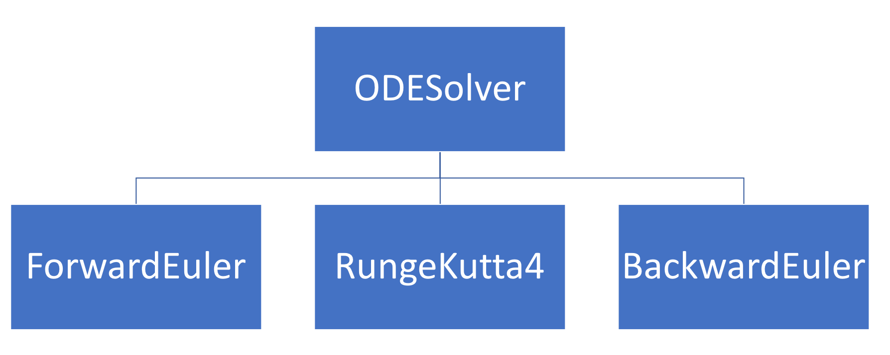
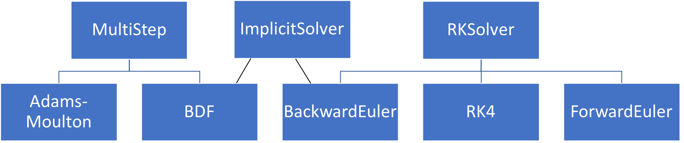

---
jupyter:
  jupytext:
    text_representation:
      extension: .md
      format_name: markdown
      format_version: '1.2'
      jupytext_version: 1.7.1
  kernelspec:
    display_name: Python 3
    language: python
    name: python3
---

# More on Object-Oriented Programming

In this week's lecture, and the next, we will go more into the theoretical basis of object-oriented programming, and show you some more advanced possibilities in Python.

## Outline
* The four pillars of OOP
* Other important OOP concepts
* Class methods and class variables
* Static methods

## The four pillars of OOP

The "four pillars" are four concepts that are central when programming object-oriented, and are often referred to in the literature. These are:

* **Abstraction**; to extract the essential features of objects we use into a common abstract concept (i.e. a class)
* **Encapsulation**; collecting all the data and functionality into a single class, that is accessed through a well-defined interface.
* **Inheritance**; defining new classes based on existing classes.
* **Polymorphism**; the idea that an object or a function can have different behavior based on the context.

### Abstraction

Abstraction means to extract the essential features of objects we use into a common abstract concept (i.e. a class). As part of the abstraction we also decouple how something is used from how it is implemented, and only need to focus on the implementation when developing the class. We can hide away unnecessary or complex details when using the class, exposing only a clean interface externally. Abstraction reduces overall code complexity and makes code easier to understand. Abstraction is essential in modern software systems, since it would be impossible to deal with the complexity of modern systems while still keeping track of all details down to the level of single bits. For instance, we work with integers and floating point numbers as abstract quantities without knowing how these are represented on the computer.

### Encapsulation

Encapsulation means collecting all the data and functionality into a single class. The concept of encapsulation is related to and to some extent overlapping with abstraction, in that we "encapsulate" details inside a class, exposing only the easy-to-use interface. Encapsulation also encompasses hiding data inside classes that the external user never interacts with directly or sees. An essential goal of proper encapsulation is that internal data structures of a class may be completely changed, but as long as the interface is untouched all code using the class will still work.
We use floating point numbers continuously in our codes, but only through the defined Python operators, never
manipulating the actual number representation in memory. Therefore, our codes still work even if the standard for floating point number representation is changed (which has happened several times through history).


### Inheritance

Inheritance means defining new classes based on existing classes. Inheritance is useful because it lets us avoid re-implementing the same methods and behaviors many times (don't repeat yourself), but also because it creates a clear *hierarchy* in your classes, which can be used to structure code. Inheritance can be seen as a central tool for *abstraction*, since the class hierarchies will (should) often map to natural hierarchical relations between different concepts. Consider an example from daily life; in most contexts it is sufficient to think of a car simply as a car, without knowing the brand, model, type, etc, while for other applications more details are needed. The same is true in many programming applications, and inheritance provides the tools for handling these relations.

### Polymorphism

Polymorphism is perhaps the most tricky concept, but it means that an object can have different behavior based on context. A blu-ray player can read both a blu-ray disc and a DVD, on a technical level, these are very different, but for the user, they are added to the player and functions the same. This would be an example of polymorphic behavior. Similarly, we can for example define a method that can take input of different types, for example an integer *or* a list of integers. The concept of polymorphism is tightly coupled to the use of inheritance and class hierarchies, in *statically typed languages*, where input arguments to a function are required to be of a specific type. With the dynamic typing in Python, polymorphic behavior can also be achieved with other methods, but using class hierarchies and OOP often leads to better structured and more readable code. By making polymorphic classes, we can generalize our classes so they can be easier to use.

In reality, the *four pillars* are closely related and partly overlapping concepts. For instance, polymorphism is typically implemented through inheritance, and inheritance is also a key tool for abstractions that have a natural hierarchy.

### A simple example to illustrate the four pillars

A general problem when introducing OOP is that the ideas are most useful for large programs. For simple example codes, that are practical to use in courses, the benefit of OOP is typically rather small. Seeing the real value of OOP therefore requires some ability to extrapolate, and try to imagine how code designs and implementations will scale to systems with 1000s of code lines.

Here is a simple examples to illustrate the four pillars. You have probably seen similar examples previously, but we repeat it here to link it directly to the four pillars. Say we have a program that uses matrices, vectors, and matrix-vector products. Vectors and matrices are conveniently stored as numpy arrays:

```python
# matrices and vectors are easily represented as numpy arrays
import numpy as np

# create some arbitrary matrix A
A = np.array([[i + j for i in range(1, 4)] for j in range(1, 4)])
print(A)

# some vector x
x = np.array([1, 0, 0])

# compute and print the product b=Ax
b = np.matmul(A, x)
print(b)
```

This is all well and good, but the code completely ignores the fact that a matrix is a well-defined and useful mathematical concept, with a strictly defined set of permitted operations. If our code was larger, and used multiple matrices, explicitly representing the abstract concept of a matrix will make the code far more readable. For that purpose, it is natural to use a class, which holds the matrix data and defines associated operations:


```python
class Matrix:
    def __init__(self, data):
        self._data = data

    def __str__(self):
        return str(self._data)

    def mul(self, x):
        return np.matmul(self._data, x)


values = np.array([[i + j for i in range(1, 4)] for j in range(1, 4)])
A = Matrix(values)
print(A)

x = np.array([1, 0, 0])
b = A.mul(x)

print(b)
```

One may argue that for this simple code not much has been gained, but it should be easy to see the potential benefits for larger systems. The incredibly useful branch of mathematics known as linear algebra would be impossible to understand without the abstract concept of a matrix. Adding the right abstraction to a code may have similar implications for its readability.

In our matrix example it makes sense to consider the third pillar, *inheritance*, before looking at the second. Assume that many of the matrices used in our program are diagonal. For large matrices, it is very inefficient to compute a matrix-vector products involving a diagonal matrix as if the matrix was full. To avoid unnecessary code duplication, we can introduce the diagonal matrix as a sub-class:


```python
class MatDiag(Matrix):
    def mul(self, x):
        return np.diagonal(self._data) * x


d = [2, 4, 6]
A = MatDiag(np.diag(d))
print(A)

x = np.array([1, 0, 0])
b = A.mul(x)
print(b)
```

While this class works, it is not very well-suited for large matrices, since we store a large number of zeros ($n\times n - n$, for an $n\times n$ matrix). We can create a more memory-friendly version of the `MatDiag` class, and at the same time illustrate *encapsulation*:

```python
class MatDiag(Matrix):
    def __init__(self, data):
        if data.ndim == 1:
            self._data = data
        elif data.ndim == 2:
            self._data = np.diagonal(data)

    def __str__(self):
        return "diag(" + str(self._data) + ")"

    def mul(self, x):
        return self._data * x


d = [2, 4, 6]
A = MatDiag(np.diag(d))
print(A)

x = np.array([1, 0, 0])
b = A.mul(x)
print(b)
```

The main change to the class is that we only store the non-zero diagonal elements. Note also that we use the  standard convention of a leading underscore on the attribute `_data`, to indicate to users of the class that this item is not to be manipulated directly. Our change of internal data structure has implications for the implementation of the constructor and the `mul` function, but users of the class will not see these changes. The class interface is not changed, and all codes that use the class will work without changes.

The fourth and final pillar, *polymorphism*, can be illustrated by the following example code, where we want to solve the linear system `Ax = b`. This can of course be done both for full matrices and diagonal matrices. However, if we care about efficiency we should utilize the matrix structure, just as we did for the matrix multiplication above. The following function implements a naive solution:

```python
"""
Note: intentionally bad coding style, breaks encapsulation
"""


def solve(A, b):
    """Solves Ax=b wrt x, choosing the
    algorithm based on the structure of A"""
    if isinstance(A, MatDiag):
        x = b / A._data
    elif isinstance(A, Matrix):
        x = np.matmul(np.linalg.inv(A._data), b)

    return x


d = [2, 4, 6]
A0 = MatDiag(np.diag(d))
A1 = Matrix(np.eye(3) + np.ones((3, 3)))
print(A0)
print(A1)
```

There are two main reasons to change this code. The first is that encapsulation is broken, since the function accesses the internal matrix data structures directly. The second one is that we use `isinstance` tests to determine the behavior. Both problems can be solved by moving the `solve` function inside the classes, and allowing the object itself to determine what function to call. The complete implementation of the classes and the function may look like:

```python
class Matrix:
    def __init__(self, data):
        self._data = data

    def __str__(self):
        return str(self._data)

    def mul(self, x):
        return np.matmul(self._data, x)

    def solve(self, b):
        return np.matmul(np.linalg.inv(_data), b)
```

```python
class MatDiag(Matrix):
    def __init__(self, data):
        if data.ndim == 1:
            self._data = data
        elif data.ndim == 2:
            self._data = np.diagonal(data)

    def __str__(self):
        return "diag(" + str(self._data) + ")"

    def mul(self, x):
        return self._data * x

    def solve(self, b):
        print(b, self._data)
        return b / self._data
```

```python
def solve(A, b):
    print(b)
    return A.solve(b)


d = [2, 4, 6]
A0 = MatDiag(np.diag(d))
print(A0)
print(A0._data)

print(solve(A0, np.array([1, 1, 1])))
```

Polymorphism implemented through class hierarchies becomes *even more important in statically typed languages*. For instance, if we were to implement something like the `solve` function above in C++, we would have to specify the type of the arguments `A` and `b`. If we specified `A` as an instance of the `Matrix` base class, the function would accept objects of all sub-classes as arguments, and things would work exactly as in Python.


### Other important OOP concepts (1)
* **Multi-level inheritance**; a class hierarchy with several levels of sub-classes. For instance we could introduce band matrix as a subclass of matrix, and diagonal matrix as a subclass of band matrix.
* **Multiple inheritance**; one subclass inherits from several base classes, defined by listing all of them in the class definition; `class SubClass(Base1, Base2):`.
* **Method resolution order (MRO)**; the rules determining the order in which Python looks for methods and data in a class hierarchy. In general, Python will progress down to up in the class hierarchy, and from left to right in the case of multiple inheritance.
* **Method overriding**; the process of writing a different function in a sub-class, which overrides the corresponding method in the base class (like the `mul` and `solve` methods in the `MatDiag` class above.
* **Abstract class**; a base class that is only used to implement common features of a class hierarchy, and which we never create instances of. Example is the *cosmic base class* `object` in Python.
* **Virtual method**; an overrideable method, i.e. a method that is declared *virtual* in the base class can be overridden in subclasses. In Python all methods are virtual by default, but this is not the case for Java and C++.


```python
# Example: multilevel inheritance


class Organism:
    pass


class Animal(Organism):
    pass


class Herbivore(Animal):
    pass


class Carnivore(Animal):
    pass


class Sheep(Herbivore):
    pass


class Wolf(Carnivore):
    pass


dolly = Sheep()

print(isinstance(dolly, Animal))
```

Inheritance implies an *is a* relationship. A herbivore *is an* animal, which in turn *is an* organism.

Note that while `isinstance` checks whether a given object instance belongs to a given class, there is also a `issubclass` that can be used on class objects. So you can for example check that a Herbivore is an animal.

### Note: Constructors in class hierarchies

The following is true for subclasses:
* The subclass automatically has all the same methods as the superclass, including the constructor
* The subclass can redefine (overwrite) any inherited method
* The subclass can define new methods

However, if a subclass wants to extend the constructor of its superclass, we might run into problems:


```python
class Car(object):
    """Store information about a car"""

    def __init__(self, brand, model, plate_nr, color, milage):
        self.brand = brand
        self.model = model
        self.plate_nr = plate_nr
        self.color = color
        self.milage = milage
```

We now want to create ElectricCar, as a subclass of Car. The only difference is we want to also add information about the battery capacity of the electric car. We want this information to go into the constructor.

Challenge: We want to get away without having to re-implement the whole constructor. This is part of the motivation behind inheritance in the first place (DRY: Don't repeat yourself.)

Let us first look at the 'naive' solution:


```python
class ElectricCar(Car):
    def __init__(self, brand, model, plate_nr, color, milage, battery):
        self.battery = battery
```

This would be great (if it worked), because we only need to add the new information of the subclass, without repeating all the old information. The problem is that when we create the `__init__`-method in the `ElectricCar`-class, we overwrite the Car method that was inherited in the first place. Thus, the new constructor would *only* remember the battery, not any of the other information.

To get around this, we can explicitly call the superclass's init function directly.

```python
class ElectricCar(Car):
    def __init__(self, brand, model, plate_nr, color, milage, battery):
        Car.__init__(self, brand, model, plate_nr, color, milage)
        self.battery = battery


tesla = ElectricCar("tesla", "model s", "EL12345", "blue", 1000, 75)
```

This way, we can use the old constructor, but add additional steps when constructing the object.

As in earlier examples, we want to avoid hard-coding in specific class names, in case we change them later, or use inheritance. To do this, we change writing `Car.__init__` with `super().__init__`. Here, `super` is a built-in Python function that refers to the superclass, when used within a subclass. So we would do:


```python
class ElectricCar(Car):
    def __init__(self, brand, model, plate_nr, color, milage, battery):
        super().__init__(brand, model, plate_nr, color, milage)
        self.battery = battery


t1 = ElectricCar("tesla", "model s", "EL12345", "blue", 1000, 75)

print(isinstance(t1, Car))
print(t1.plate_nr)
```

**Note this potential source of confusion:**
* When referencing the base class constructor through the `super()` function, we do not pass `self` as the first argument!
* If we directly referenced the base class through `Car.__init__`, we need to pass `self`.

This is part of the behavior of Python's `super` function. The intention for this function is that it should always be invoked on an instance, and therefore `self` is passed automatically. When referencing the class directly, the class has no idea of an instance, so this needs to be explicitly passed. The recommended solution is to simply remember its behavior, and always use `super()` to invoke a base class constructor, never the direct class reference.

### Multiple inheritance

A class can inherit from multiple base classes. There is a never-ending debate on whether or not this is a good idea. It may be useful in certain applications, but also tends to make class hierarchies quite complicated.


```python
class Human(Animal):
    pass


class Machine:
    pass


class Cyborg(Human, Machine):
    pass


c1 = Cyborg()
```

To consider a more useful example, consider the `ODESolver` hierarchy introduced in Langtangen's *A primer on scientific programming with Python*:


This is a small class hierarchy of ODE solvers, which makes sense because there is clearly an "is-a" relationship between the sub-classes and the base class. However, one of the three solver sub-classes, the `BackwardEuler`, is of a different nature than the others, and requires a separate class or module `Newton`, for solving non-linear algebraic equations. While there is nothing wrong with this solution, an alternative approach would be to put this code in a separate base class, and have the `BackwardEuler` class inherit from this.

Such a class hierarchy makes more sense if we include a larger collection of solvers, for instance including both methods of the *Runge-Kutta type* and so-called *multi-step methods*. Both of these classes of methods have both explicit and implicit versions, and although the methods themselves are quite different, the implicit methods rely on similar tools for solving non-linear algebraic equations. An example class hierarchy may look like this:


The class structure clearly separates the two classes of ODE solvers, while still allowing both types of implicit methods to inherit from the same base class. The hierarchy also makes sense because it preserves the "is-a" relationships; the solver `BDF` is a multi-step method, and it is also an Implicit method, as reflected in the hierarchy. While this is clearly not the only way this could be implemented, multiple inheritance in this case provides a logical and well-structured hierarchy, which also maximizes code reuse.

#### Quiz 1: Which base class constructor will be called here?


```python
class Human:
    def __init__(self):
        print("Calling Human constructor")


class Machine:
    def __init__(self):
        print("Calling Machine constructor")


class Cyborg(Human, Machine):
    def __init__(self):
        print("Calling Cyborg constructor")
        super().__init__()


c1 = Cyborg()
```

And you are unsure about the method resolution order, it is also possible to just print it (then it is clear that Human is next after Cyborg)

```python
Cyborg.mro()
```

#### Quiz 2: What will be output by the print calls?


```python
class A(object):
    def f(self):
        return "A::f()"

    def g(self):
        return "A::g()"

    def h(self):
        return "A::h()"


class B(A):
    def h(self):
        return "B::h()"


class C(B):
    def g(self):
        return "C::g()"


a, b, c = A(), B(), C()
print("a: ", a.f(), a.g(), a.h())
print("b: ", b.f(), b.g(), b.h())
print("c: ", c.f(), c.g(), c.h())
```

## Class Methods and Variables

In most examples we have seen in the course so far, we first implement a class, and then create *instances* of that class, i.e., objects of that class type. However, once created, these objects do not affect each other directly, they are simply the same type of object.

However, it is possible to create variables that belong to the *class*, and not specific objects.

### Three common uses of class variables and class methods are:
* To keep track of the number of objects created of a class
* To store global parameters, that should be the same for all instances
* So-called 'factory methods', which creates new objects in different ways than what is commonly done in the constructor

For the first example, we simply keep a counter running that increases every time we create a new object of the class:


```python
class Rabbit:
    nr_of_rabbits = 0

    def __init__(self, age):
        Rabbit.nr_of_rabbits += 1
        self.age = age


print(Rabbit.nr_of_rabbits)

alice = Rabbit(2)
buddy = Rabbit(4)
charlie = Rabbit(7)

print(Rabbit.nr_of_rabbits)
```

Here, `nr_of_rabbits` is a class variable, because it belongs to the class itself. The `age` attributes however, are *instance* variables, as they belong to each individual instance of the class. In the constructor of the class, we increment `Rabbit.nr_of_rabbits` by 1, thus, each time a new rabbit object is created, this variable grows.

Note that even though there is no *instance* variable called `nr_of_rabbits`, we can access it from the objects too:


```python
print(alice.nr_of_rabbits)
```

This is because when we write `alice.nr_of_rabbits`, Python first checks for a instance variable by this name, but if none is found, like in this case, then it instead uses the class variable.

However, you should be a bit careful here, because if we try to redefine `alice.nr_of_rabbits` (or `self.nr_of_rabbits` inside the constructor), then we actually create an instance variable, rather than change the class variable. This is why we write `Rabbit.nr_of_rabbits += 1`, rather than self. Let us try the other version and see what happens:


```python
class Rabbit:
    nr_of_rabbits = 0

    def __init__(self, age):
        self.age = age
        self.nr_of_rabbits += 1  # Intentionally wrong!


alice = Rabbit(2)
buddy = Rabbit(4)
charlie = Rabbit(7)

print(Rabbit.nr_of_rabbits)
print(alice.nr_of_rabbits)
```

Obviously, this does not behave as we expect. We want `nr_of_rabbits` to be 3, since we created 3 rabbits. But we see that the class variable `Rabbit.nr_of_rabbits` reports 0 rabbits, and `alice.nr_of_rabbits`, which should just default to the class variable reports 1 rabbit!  What is actually happening here?

When we write:
```python
self.nr_of_rabbits += 1
```
This is equivalent to writing
```python
self.nr_of_rabbits = self.nr_of_rabbits + 1
```

Now the right hand side is evaluated first. When creating the object, the new rabbit has no `nr_of_rabbits` instance variable, so it looks up the class variable instead, which is 0, then we add 1, giving 1 as a result.

Now, this is supposed to be stored in the variable to the left of the assignment operator (`=`), but `self.nr_of_rabbits` is interpreted by Python as if we want to create this instance variable. Therefore, the new rabbit object gets its own personal `nr_of_rabbit` instance variable, and the class variable never gets updated.

Note that this happens because an integer is *immutable*. If we had a class variable that was mutable, then it would behave differently. We could for example contain all objects of a class in a list as a class variable:


```python
class Rabbit:
    all_rabbits = []

    def __init__(self, name, age):
        self.name = name
        self.age = age
        self.all_rabbits.append(self)

    def __repr__(self):
        return f"{self.__class__.__name__}({self.name})"


Rabbit("Alice", 2)
Rabbit("Buddy", 4)
Rabbit("Charlie", 7)
```

In this case, writing `self.all_rabbits.append(self)` means we add the object itself to the class variable list. Because lists are mutable, we end up changing the class variable, instead of creating an instance variable. Although it works writing `self.all_rabbits` in this case, it isn't very readable for a user, as they might think this is a instance variable because of the `self`. So here, it would be better to just write out `Rabbit.all_rabbits`, or `self.__class__.all_rabbits`, to make it clear to the user that this is the class variable that is being changed.

### Parameters as class variables

Class variables are well suited for storing parameters that are usually shared by all objects of the class. Take for instance a Pendulum class


```python
class Pendulum:
    G = 9.81

    def __init__(self, M=1, L=1):
        self.M = M
        self.L = L
```

In this class, we can create pendulums of different lengths and masses. We can then use `self.M` and `self.L` to refer to these in calculations. Note that we can also refer to `self.G` in calculations, but this will use the class variable `G`, as the objects contain no specific G. We let `G` be a class variable, because all our pendulums typically experience the same gravity.

```python
p = Pendulum(M=4, L=2)
print(p.M)
print(p.L)
print(p.G)
```

One benefit of defining parameters that should be shared across all objects as a class variable is that it is now easy to change the parameter for all objects, those already created and those we create in the future.


```python
Pendulum.G = 10
print(p.G)
```


Thus, the parameter has a single, definite representation in our system. Which is usually a good approach.

## Class Methods

In addition to defining class variables, we can define class methods. Class methods are methods we call on the *class*, not on a specific object. The easiest approach to creating a class method in Python is to use the `@classmethod` decorator. One of the typical use cases for a class method are *factory methods*. Factory methods are methods that create objects of the class, but perhaps in a different way than what the constructor does.

A Python class can only have one constructor. Creating objects in different ways is achieved through factory methods:


```python
import numpy as np


class Sphere:
    def __init__(self, radius):
        self.radius = radius

    def volume(self):
        return 4 * np.pi * self.radius**3 / 3

    @classmethod
    def from_volume(cls, volume):
        radius = (3 * volume / (4 * np.pi)) ** (1 / 3)
        return cls(radius)
```


Here, we make our `Sphere` class as normal, where we create spheres by specifying their radius. However, sometimes, we might want to instead create a sphere with a given volume. To do this, we create a *factory method*. We then use the `@classmethod` decorator to create it, for normal *instance* methods, the first argument to a method is always the self, but now we call the first argument is `cls`, which is short for "class".

We can use the class method as follows:


```python
ball = Sphere.from_volume(5000)
print(f"Radius: {ball.radius:.1f} \t Volume: {ball.volume():.1f}")
```


Here, because we defined the method as a class method,
``` Python
Sphere.from_volume(5000)
```
is actually interpreted as
``` Python
Sphere.from_volume(Sphere, 5000)
```
And so `cls` would refer to the class itself within the class method, exactly like `self`  refers to the object itself in normal instance methods.


A common usage of factory methods is to choose the right subclass based on user input. As an example, consider again the `ODESolver` class hierarchy, and say we want to let the user pass a string to the class to specify the solver, as in:
``` Python
solver = ODESolver.create_solver('FE',f)
```
One may think that this could also be solved by simply adding a string argument to the `ODESolver` constructor:
``` Python
solver = ODESolver('FE',f)
```
But this will not work since we are not creating an `ODESolver` instance, but an instance of one of the subclasses.


The solution is a factory method which knows about the subclasses:
``` Python
@classmethod
def create_solver(cls,solver_type,f):
    SOLVER_TO_CLS_MAP = {
        'FE':  ForwardEuler,
        'BE': BackwardEuler,
        'RK4': RungeKutta4
    }

    if solver_type not in SOLVER_TO_CLS_MAP:
        raise ValueError(f'Bad solver type {message_type}')

    return SOLVER_TO_CLS_MAP[solver_type](f)
```


### Other factory method use cases

* Create factory methods for unit testing, i.e. initiate some instances with predefined parameters.
* Initiating objects based on *random* data.
* Create objects from a file. By creating a factory method `from_file` which reads in some data file, and sets up the object accordingly. Here, we can also create a method for saving all the data in the object to a file, which can be read in later. This would be an example of *[checkpointing](https://en.wikipedia.org/wiki/Application_checkpointing)*, which is an extremely useful feature for computations and simulations that take a long time to run.


## Static Methods

Another kind of method, which is different from both class methods and instance methods, are the *static* methods. These are methods that while they belong to a class, is called without using any class or object information. You define a static method with the `@staticmethod` decorator, unlike instance and class methods, the static methods do not take any particular variable in as the first variable.

The static methods do not use any information about the class or object, and so *could* for all intents and purposes just be a stand-alone function. However, we like to implement it as a static method, because then the functionality is stored within the class, and makes the whole code cleaner.


```python
from datetime import date


class Person:
    def __init__(self, name, birthday):
        self.name = name
        self.birthday = birthday

    def age(self):
        return self.calculate_age(self.birthday)

    @staticmethod
    def calculate_age(birthday):
        day, month, year = birthday.split(".")
        day = int(day)
        month = int(month)
        year = int(year)
        today = date.today()
        return (today.year - year) - ((today.month, today.day) < (month, day))
```


Here we have created a static method `calculate_age`, that computes the age of a person right now, given that person's birthday as a string on the form "dd.mm.yyyy". We can call this function as


```python
print(Person.calculate_age("20.02.1975"))
```

This function is a "stand-alone" function, it doesn't depend on any class or instance data. However, after we have created this method, we can use it in the `age` method, which returns the age of a given person-object.


```python
p = Person("Joe Schmoe", "17.04.1983")
print(p.age())

print(p.calculate_age)
```


### Class Methods vs Static Methods (1)
Static methods and class methods appear to be quite similar. The difference can be understood by considering the Python concept of *bound methods*:
* An ordinary function in Python is often called an unbound function, because it is not bound to a particular class or object.
* On the other hand, a regular instance method defined in a class becomes *bound to an instance* every time a new instance of the class is generated. In fact, when we create a new instance, we also create a new function object, which is bound to that instance and thereby becomes a bound method. Each instance has its own method object. The most important effect of this binding is that the instance is automatically passed as the first argument to the method (`self`).


### Class Methods vs Static Methods (2)
* Using the `@classmethod` decorator simply tells Python that this function should be bound to the class and not the instance. No matter how many instances we create, there will only exist one method object, and when we call it the class (`cls`), and not the instance, is automatically passed as the first argument. The method can still be accessed through a specific instance, but it still remains bound to the class and the class is passed as the first argument.
* Finally, when we use the `@staticmethod` decorator, we tell Python that this function should not be bound to either the class or the instance, but remain an unbound function. It is still defined within the *namespace* of the class, and can be accessed either through the class or through a specific instance (as for `calculate_age` above), but it remains an unbound Python function and no arguments get passed automatically.


### Class Methods vs Static Methods (3)
These differences lead to the following "rules" for when to use the different methods:
 * Use a regular instance method if it needs access to instance data. This is by far the most common use case in OOP.
 * If the method does not need access to instance data, but it does access class data, define it as a class method.
 * Finally, if the method logically belongs to the class, but does not operate on either
 instance data or class data (i.e. neither `self`, `cls`, or the class name appear inside the function body) it should be a static method.


#### Quiz: why is this factory method a @classmethod, not a @staticmethod?
``` Python
@classmethod
def create_solver(cls,solver_type,f):
    SOLVER_TO_CLS_MAP = {
        'FE':  ForwardEuler,
        'BE': BackwardEuler,
        'RK4': RungeKutta4
    }

    if solver_type not in SOLVER_TO_CLS_MAP:
        raise ValueError(f'Bad solver type {solver_type}')

    return SOLVER_TO_CLS_MAP[solver_type](f)
```


#### Answer:
This was a trick question. The method could just as well be a `@staticmethod`, since neither `self` nor `cls` appear inside the function body. However, it is still a good idea to keep it a `@classmethod`, because
* We could have made the solver to class map more flexible by using the builtin function `cls.__subclasses()`, and this would only work with a class method.
* It is common in Python to implement factory methods as class methods, so following this convention makes the code more readable. (However, in C++ and other programming languages, it is common to implement factory methods as static methods.)


### Composition over Inheritance

An important principle or design pattern in object oriented programming states that we should prefer "*[Composition over Inheritance](https://en.wikipedia.org/wiki/Composition_over_inheritance)*. One reason why you sometimes want to avoid using inheritance is because changes in the base class can result in unexpected results in the class that inherits from the base class. This is very well explained is a [talk given by Ariel Ortiz at pycon 2019](https://youtu.be/YXiaWtc0cgE)

To illustrate the concept of composition and inheritance let us consider the `Vector` class from week 2.

```python
import numpy as np


class Vector3D:
    def __init__(self, x, y, z):
        self.x = x
        self.y = y
        self.z = z

    def __repr__(self):
        return f"{self.__class__.__name__}({self.x}, {self.y}, {self.z})"

    def __add__(self, other):
        x = self.x + other.x
        y = self.y + other.y
        z = self.z + other.z
        return Vector3D(x, y, z)
```

Now, say we want to use the Vector as parameter in a model and attach a name to it. Then we could just create a new  class that inherits from the Vector3D class.

```python
class ModelVector1(Vector3D):
    def __init__(self, name, x, y, z):
        self.name = name
        super().__init__(x, y, z)

    def __add__(self, other):
        vector_sum = super().__add__(other)
        return ModelVector1(
            "+".join([self.name, other.name]), vector_sum.x, vector_sum.y, vector_sum.z
        )


u = ModelVector1("vector1", 2, 0, -2)
v = ModelVector1("vector2", 2, 4, 2)
w = u + v

print(f"{u} + {v} = {w}")
print(w.name)
```

This is an example of inheritance. First of all we see many calls to the methods on the base class though `super` which makes the code difficult to read. Secondly if the super class __add__ function  changes it will also change the behavior of the ModelVector class which might not be what we want.

In stead we could use composition. This means that we do not need to care about how vector is implemented.

```python
# First of all we need to call the super class all the time, and second if the super class __add__ function
# changes it will also change the behavior of the ModelVector class and we might need to change the the code.

# What we should do instead is the following


class ModelVector2:
    def __init__(self, name, vector):
        self.name = name
        self.vector = vector

    def __add__(self, other):
        return ModelVector2(
            "+".join([self.name, other.name]), self.vector + other.vector
        )

    def __repr__(self):
        return f"{self.__class__.__name__}({self.name}, {self.vector})"


u = ModelVector2("vector1", Vector3D(2, 0, -2))
v = ModelVector2("vector2", Vector3D(2, 4, 2))
w = u + v

print(f"\n{u} + {v} = {w}")
print(w.name)
```

It also makes our code reusable. Say that we now want to implement ModelMatrix. The all we need to do is to provide a matrix as the second argument. In fact the only thing that is required is that the second argument has an implementation of `__add__`, so we could also simply provide integers.

```python
# And this ModelVector2 class also works with any variable that implements add
u = ModelVector2("first value", 2)
v = ModelVector2("second value", 4)
w = u + v

print(f"\n{u} + {v} = {w}")
print(w.name)
```

For more example of design patterns in python check of the article [Design Patterns in Python for the Untrained Eye](http://34.212.143.74/s201911/pycon2019/docs/design_patterns.html)


## Summary of OOP
* The *four pillars* of OOP; a set of concepts that provide the foundation for OOP. The concepts are somewhat overlapping, and not all have a precise definition, but it is important to have an   idea of their meaning and usage:
    * Abstraction; collect common features into a common concept, a class
    * Encapsulation; interface the class through a defined interface, hide details from users
    * Inheritance; make new classes as specializations of a base class
    * Polymorphism; implement object-specific behavior by placing the relevant code inside the sub-class. The concept of virtual methods ensures that the right code is called.
* Other central OOP concepts include:
    * Multi-level inheritance; a class hierarchy with >2 levels
    * Multiple inheritance; a class can inherit from multiple base classes
    * MRO (method resolution order); the order in which Python searches for methods (in a class hierarchy).
    * Method overriding; "replacing" a base class method with a specialized version in a subclass
    * Virtual method; a method that can be overridden (by default all methods in Python)
* Class methods and variables:
    * Methods and variables that belong to the class, not to a particular instance
    * Typical use of class variables; count the number of objects, global parameters
    * Typical use of class methods; factory methods ("alternative constructors")
* Static methods:
    * Similar to class methods, but cannot modify the class state
    * Typical use; utility functions that do not use the class data, but logically belong to the class


## Names, Namespaces and Scope

* We constantly define new names for variables, functions, classes, etc., and import numerous others from modules and packages.
* It would be impossible to keep track of all the names that are used throughout a large program and all its imports.
* Potential name conflicts are resolved using the concepts of *namespaces* and *scope*.


### Python namespaces
A *namespace* is simply a mapping from names to objects. Within a single namespace, names should uniquely define an object, but objects in different namespaces may have the same local name. A real-world analogy is license plate numbers for cars. In Norway, the license plate uniquely identifies a car, but if you go to Denmark a car can have exactly the same number combination. The two countries define different *namespaces*, and to uniquely identify a car you need to know *both the namespace and local name*. An example closer to the world of programming is a directory in a file system. Each directory defines a local namespace, so two files having identical names but stored in different directories are uniquely identified.


In Python, namespaces are created dynamically as objects are created. A namespace containing all the builtin Python names is created when Python starts, and is never deleted. Similarly, all variables created in the top level script exist in the global namespace (`__main__`), and each module has its own global namespace, which also normally exist until Python ends. A class definition creates a new namespace local to that class. Since a class definition is usually not deleted, this namespace also exists until we end Python. On the other hand, every time we create an instance of the class we create a new local namespace, which is deleted when the object is deleted, and when a function is called it creates a new local namespace, which exists until the function is done executing.


We access names in different namespaces using the standard *dot* notation, as in `math.exp`, `numpy.array`, `Sphere.from_volume`, `p.Name`, etc. If we don't use the dot notation to specify which namespace a variable name belongs to, Python will search for the name according to a predefined set of rules, starting with the local namespace and moving up the hierarchy of more "global" namespaces. See the discussion of scope below for a more precise definition.


If we understand how Python namespaces work, the difference between the various ways we import module becomes quite clear:
```python
import numpy
```
will simply create a new namespace with the name `numpy`, containing all the variable and function names defined in the `numpy` module. The statement
```python
import numpy as np
```
does the same thing, but gives the name `np` to the new namespace we have created. Prefixing with `np.` gives access to all the names defined by the module. On the other hand, the statement
```python
from numpy import *
```
will not create a new namespace, but instead imports all the names defined by NumPy into the current, global namespace. This makes the names directly accessible without prefixing, but also creates potential for name conflicts. To clearly see the difference you can call the function `dir()` in an interactive Python window. This function returns a list of names currently available in the local namespace, and the names of all the existing namespaces. After checking the output of `dir()` import NumPy using the different approaches and call the function again.


### Scope of names and namespaces

A *scope* of a variable is defined as the part of the program where a variable name is accessible. When a Python program is running, there are several nested scopes in which the variable names are directly accessible, i.e. whose namespaces are searched automatically (without the need to prefix):
* The local (innermost) scope includes the local variables defined inside a function, as well as all parameters passed to a function. This namespace is searched first
* The local scope of all enclosing functions, if you have a function definition inside a function definition.
* The global scope of the module or program, i.e., variables and function names defined at the top level of the program.
* The global namespace of Python builtin names.


Variables in Python are local by default. If you define a variable inside a function, the variable does no longer exist when the function is done executing. Technically, the variable name is defined in the local namespace of the function, and this namespace is deleted when the function is done executing:


```python
def pancake_area():
    pi = 3.14159
    r = 15

    return pi * r**2


print(pancake_area())

# print(r)  #Will not work since r does not exist outside function
```


If a global variable with the same name exists, a new local variable will still be created inside the function. Inside a function we can access a global variable, but any attempt to modify it will create a new local variable:


```python
pi = 3.14159
r = 10


def pancake_area():
    r = 15  # creates a new local variable

    return pi * r**2  # here r is local, pi is global


print(pancake_area())

print(r)  # prints the global r
```


We can override the default behavior using the keyword `global` when we define a variable:


```python
pi = 3.14159
r = 10


def pancake_volume():
    global r
    r = 15
    thickness = 0.2

    return pi * r**2 * thickness


print(pancake_volume())

print(r)  # now r is changed
```


WARNING: The `global` keyword should hardly ever be used. Global variables are generally considered bad programming style, and can cause multiple errors. There is nearly always a better way to achieve what you want, without using global variables. Note also that in the example above, the variable `r` is only defined after the function has been called for the first time, which further adds to the potential confusion.

**As a general rule, all variables needed by a function should be passed as arguments, and all variables modified by a function should be returned.**


The other way around, defining variables in global scope and using them inside a function is also often considered bad practice (although not quite as bad). The following example may be considered acceptable since `pi` is a global constant not likely to be changed:


```python
pi = 3.14159


def pancake_volume():
    r = 15
    thickness = 0.2

    return pi * r**2 * thickness
```


But in general this programming style should be avoided, since it is difficult to know that the global variable has not been accidentally changed by another part of the program.

As another example, assume that your code includes a very expensive function call, and you want to count how many times this function is called in your program. This is a fairly common thing to do when profiling and optimizing a code (although there are tools to automate it, so you rarely have to write the code yourself). The following code will work:


```python
no_function_calls = 0


def expensive_func():
    global no_function_calls
    no_function_calls += 1
    """
    Some massive computation
    """
    return None


for i in range(3):
    expensive_func()


print(no_function_calls)
```


If we leave out the line `global no_function_calls` (try it!), Python will automatically detect that we are trying to modify the `no_function_calls` variable, and therefore assume that it must be a local variable. Since no local variable with this name exists, we get an error message stating that the variable is used before it is defined.


### The `locals` and `globals` dictionaries

We can access the global and local variables with the built-in functions `globals()` and `locals()`, which return dictionaries of the available names:


```python
# print(globals()) #gives lots of output (all the names defined so far)
# print(locals()) #same output since we are in the global scope

print(locals() == globals())  # should return True


def tiny_function():
    a = 1
    b = 1.5
    # print the variables in the local scope:
    print(locals())
    return a + b


# look up a name the globals dictionary:
print(globals()["tiny_function"])

tiny_function()
```

It is even possible to add variables to the global scope by simply sticking it in the globals dictionary. For example `c` is not defined, so let us put it in the `globals` dictionary

```python
globals()["c"] = 0
print(c)
```


This is not something you should do, but it is nice to know how it works.

The output from `locals()` is similar to that of `dir()`, which when called without arguments will return a list of valid names in the current local scope. However, while `dir` returns a list of names, `locals()` gives a dictionary of variable names and values. As described above there may be several nested scopes, but `locals()` will always return the names of the innermost local scope, and `globals()` returns the names of variables defined in the outermost global scope.


### Closure

If one sticks to the general coding practice of passing variables as arguments and return values, and avoiding the use of global variable, one rarely needs to think about how Python searches its namespaces or how names are transferred from one namespace to another. However, one particular example worth knowing about is known as *closure*, and is frequently used by Python programmers. Consider the example of a function that uses some parameters, which can be implemented as a class with a `__call__` special method:


```python
class ThrowClass:
    def __init__(self, v0):
        self.v0 = v0
        self.g = 9.81

    def __call__(self, t):
        return self.v0 * t - 0.5 * self.g * t**2


throw1 = ThrowClass(v0=5.0)

for i in range(5):
    t = i * 0.05
    print(f"{t:.2f} {throw1(t):.2f}")
```


An alternative implementation, which many will consider more "Pythonic" avoids the class concept completely:


```python
def throw_fun(v0):
    g = 9.81

    def height(t):
        return v0 * t - 0.5 * g * t**2

    return height


throw2 = throw_fun(5.0)

for i in range(5):
    t = i * 0.05
    print(f"{t:.2f} {throw2(t):.2f}")
```


What happens here is that when the function `throw_fun` is called, it defines a local namespace containing `v0,g`. The function `height` will search this namespace for variable names that it cannot find in its own local namespace. The magic happens when the `throw_fun` function returns a `height` function (note that the function itself is returned, not the result of the function call). Now, the returned function will remember the namespace defined by the outer function, even after `throw_fun` is done executing and the namespace is therefore deleted. This namespace is locked to the function object `throw2` and even if we create a new global `v0` variable all calls to `throw2` will use the value 5.0.

There is also a function called `partial` from the `functools` library which returns a partial function which some of the arguments set


```python
from functools import partial


def throw_fun(v0, t, g=9.81):
    return v0 * t - 0.5 * g * t**2


# Sets the first argument (i.e v0) to 5.0
throw3 = partial(throw_fun, 5.0)

for i in range(5):
    t = i * 0.05
    print(f"{t:.2f} {throw3(t):.2f}")
```

### Summary of scopes and namespaces
* Python variables are by default local. When a name occurs, Python will first search the local namespace, then successively more "global" spaces until it finds a variable with that name.
* A variable defined in the global scope can be accessed inside functions, but any attempt to modify it will create a new, local variable.
* The keyword `global` can be used to override the default behavior, and modify global variables inside function. However, this is bad practice that should normally be avoided.
* To avoid name conflicts, use import statements like `import math` to create a new namespace for the imported module, rather than importing everything into the existing namespace with `from math import *`
* The functions `globals(), locals(), dir()` are useful for examining existing namespaces.
* When a function is defined inside another function, it remembers the namespace of the outer function. This technique, called closure, can be used to create parameterized function.


### Exit codes

In this section we will cover a topic that might seem a bit strange but will make more sense when we transition from python to C++. Imagine that you want to chain together two commands in the terminal, meaning that you for example first want to run a python program and if that completes without errors you would like to do something else. Consider the following program

```python
# divide.py

import sys


def main(args):
    if len(args) != 2:
        print("You need to provide 2 arguments")
    else:
        print(f"The result is {float(args[0]) / float(args[1])}")


if __name__ == "__main__":
    main(sys.argv[1:])
```
Here we ask the user to provide two numbers and the program will print the first number divided by the second, e.g
```
$ python divide.py 4 2
The result is 2.0
```
The execution of this program was successful because it ran without any errors. We can verify this by checking that the exit code is `0`
```
$ echo $?
0
```
Here `echo` is the equivalent of `print` in python, but in `bash`, and $? just mean *the exit code of the last running program*.
If you try to run the program with the input `1` and `0` you will get the following
```
$ python divide.py 1 0
Traceback (most recent call last):
  File "/Users/henriknf/divide.py", line 12, in <module>
    exit(main(sys.argv[1:]))
  File "/Users/henriknf/divide.py", line 8, in main
    print(f"The result is {float(args[0]) / float(args[1])}")
ZeroDivisionError: float division by zero
```
and now the exit code is `1`
```
echo $?
1
```
Why is this important? If you have a big program the consist of several programs then exit codes are a way to tell the next program if the previous program failed. In `bash` you can chain together programs using `&&`, for example
```
$ python divide.py 4 2 && echo 'Success!'
The result is 2.0
Success!
```
and we we that 'Success!' is printed after the python program is finished. However, if you try
```
$ python divide.py 1 0 && echo 'Success!'
Traceback (most recent call last):
  File "/Users/henriknf/test/divide.py", line 12, in <module>
    main(sys.argv[1:])
  File "/Users/henriknf/test/divide.py", line 8, in main
    print(f"The result is {float(args[0]) / float(args[1])}")
ZeroDivisionError: float division by zero
```
you will only get the error and not the message 'Success!'. This is because `bash` knows that it should stop if it receives a non-zero exit code.

Now, you may want to also abort the program if you provided to few or too many arguments to the script, but currently we get the following behavior if you for example try to provide three arguments
```
$ python divide.py 4 2 3 && echo 'Success!'
You need to provide 2 arguments
Success!
```
which is not what we want. One way to handle this is to return an exit code from the program to the `exit` method so that your program becomes
```python
import sys


def main(args):
    if len(args) != 2:
        print("You need to provide 2 arguments")
        return 2
    else:
        print(f"The result is {float(args[0]) / float(args[1])}")


if __name__ == "__main__":
    exit(main(sys.argv[1:]))
```
Note that the value `2` (which is chosen somewhat arbitrarily) is returned and passed to the `exit` method if the number of arguments are different from two. If we try to repeat the procedure above we get
```
$ python divide.py 4 2 3 && echo 'Success!'
You need to provide 2 arguments
```
which is what we want. Note that if you want to continue the program even if a failure occurs (such as `ZeroDivisionError`) you can just add a `try-except` block and just suppress the error that way.
